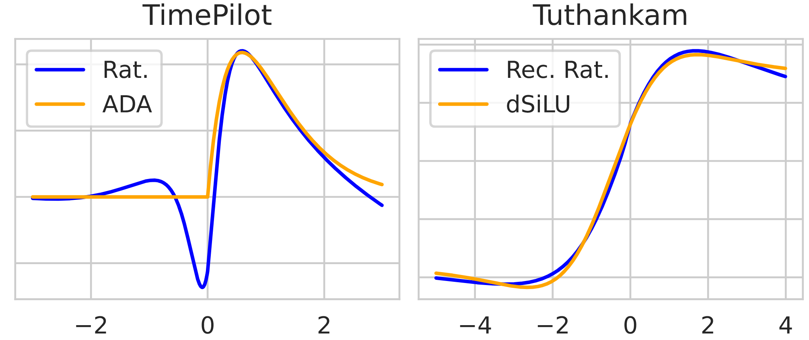

[](https://arxiv.org/abs/2102.09407)
[](https://paperswithcode.com/sota/atari-games-on-atari-2600-tennis?p=recurrent-rational-networks)


# Rational Activations - Learnable Rational Activation Functions
First introduce as PAU in Padé Activation Units: End-to-end Learning of Activation Functions in Deep Neural Network.

## 1. About Rational Activation Functions

Rational Activations are a novel learnable activation functions. Rationals encode activation functions as rational functions, trainable in an end-to-end fashion using backpropagation and can be seemingless integrated into any neural network in the same way as common activation functions (e.g. ReLU).

### Rationals: Beyond known Activation Functions
Rational can approximate any known activation function arbitrarily well (*cf. [Padé Activation Units: End-to-end Learning of Flexible Activation Functions in Deep Networks](https://arxiv.org/abs/1907.06732)*):
  
  (*the dashed lines represent the rational approximation of every function)

Rational are made to be optimized by the gradient descent, and can discover good properties of activation functions after learning (*cf [Recurrent Rational Networks](https://arxiv.org/pdf/2102.09407)*):
  
### Rationals evaluation on different tasks
* They were first applied (as Padé Activation Units) to Supervised Learning (image classification) in *[Padé Activation Units:...](https://arxiv.org/abs/1907.06732)*.

  

  :octocat: See [rational_sl](https://github.com/ml-research/rational_sl) github repo

Rational matches or outperforms common activations in terms of predictive performance and training time.
And, therefore relieves the network designer of having to commit to a potentially underperforming choice.

* Recurrent Rational Functions have then been introduced in [Recurrent Rational Networks](https://arxiv.org/pdf/2102.09407), and both Rational and Recurrent Rational Networks are evaluated on RL Tasks.
  
 :octocat: See [rational_rl](https://github.com/ml-research/rational_rl) github repo

## 2. Dependencies
We support ***MxNet, Keras, and PyTorch***. Instructions for MxNet can be found [here](rational/mxnet). Instructions for Keras [here](rational/keras).
The following README instructions **assume that you want to use rational activations in PyTorch.**

    PyTorch>=1.4.0
    CUDA>=10.2


## 3. Installation

To install the rational_activations module, you can use pip, but:<br/>

:bangbang:  You should be careful about the CUDA version running on your machine.

To get your CUDA version:

    import torch
    torch.version.cuda

For non TensorFlow and MXNet users, or **if the command bellow don't work** the package listed bellow don't work on your machine:
#### TensorFlow or MXNet (or PyTorch not CUDA optimized)

     pip3 install -U pip wheel
     pip3 install torch rational_activations

If you want a CUDA optimized version:

For **your** corresponding version of CUDA, please use one of the following command blocks:

#### CUDA 10.2 & PyTorch 1.7.1 (default one)

     pip3 install -U pip wheel
     pip3 install torch rational_activations_cu102


#### CUDA 11.0 & PyTorch 1.7.1 (default one)
##### Python3.6

       pip3 install -U pip wheel
       pip3 install torch==1.7.1+cu110 -f https://download.pytorch.org/whl/torch_stable.html
       pip3 install rational_activations_cu110

#### CUDA 11.0 & PyTorch 1.8.1 (latest one)
##### Python3.6

        pip3 install -U pip wheel
        pip3 install torch==1.8.1+cu110 -f https://download.pytorch.org/whl/torch_stable.html
        pip3 install https://github.com/ml-research/rational_activations/blob/master/wheelhouse/torch1.8.1/cuda-11.0/rational_activations_cu110-0.2.0-cp36-cp36m-manylinux2014_x86_64.whl?raw=true

##### Python3.7

       pip3 install -U pip wheel
       pip3 install torch==1.8.1+cu110 -f https://download.pytorch.org/whl/torch_stable.html
       pip3 install https://github.com/ml-research/rational_activations/blob/master/wheelhouse/torch1.8.1/cuda-11.0/rational_activations_cu110-0.2.0-cp37-cp37m-manylinux2014_x86_64.whl?raw=true

##### Python3.8

         pip3 install -U pip wheel
         pip3 install torch==1.8.1+cu110 -f https://download.pytorch.org/whl/torch_stable.html
         pip3 install https://github.com/ml-research/rational_activations/blob/master/wheelhouse/torch1.8.1/cuda-11.0/rational_activations_cu110-0.2.0-cp38-cp38-manylinux2014_x86_64.whl?raw=true


#### Other CUDA/Pytorch</h3>
You can find other wheels at [this address](https://github.com/ml-research/rational_activations/tree/master/wheelhouse), download a raw version and install it via `pip3 install rational_activations*.whl`.

For any other combinaison of python, please install from source:

     pip3 install airspeed
     git clone https://github.com/ml-research/rational_activations.git
     cd rational_activations
     python3 setup.py install --user


If you encounter any trouble installing rational, please contact [this person](quentin.delfosse@cs.tu-darmstadt.de).

## 4. Using Rational in Neural Networks
Please also check [the documentation](https://rational-activations.readthedocs.io/en/latest/) :notebook_with_decorative_cover:	
Rational can be integrated in the same way as any other common activation function.

~~~~
import torch
from rational.torch import Rational

model = torch.nn.Sequential(
    torch.nn.Linear(D_in, H),
    Rational(), # e.g. instead of torch.nn.ReLU()
    torch.nn.Linear(H, D_out),
)
~~~~

## 5. Cite Us in your paper
```
@inproceedings{molina2019pade,
  title={Pad{\'e} Activation Units: End-to-end Learning of Flexible Activation Functions in Deep Networks},
  author={Molina, Alejandro and Schramowski, Patrick and Kersting, Kristian},
  booktitle={International Conference on Learning Representations},
  year={2019}
}

@article{delfosse2021recurrent,
  title={Recurrent Rational Networks},
  author={Delfosse, Quentin and Schramowski, Patrick and Molina, Alejandro and Kersting, Kristian},
  journal={arXiv preprint arXiv:2102.09407},
  year={2021}
}

@misc{delfosse2020rationals,
  author = {Delfosse, Quentin and Schramowski, Patrick and Molina, Alejandro and Beck, Nils and Hsu, Ting-Yu and Kashef, Yasien and Rüling-Cachay, Salva and Zimmermann, Julius},
  title = {Rational Activation functions},
  year = {2020},
  publisher = {GitHub},
  journal = {GitHub repository},
  howpublished={\url{https://github.com/ml-research/rational_activations}}
}
```
